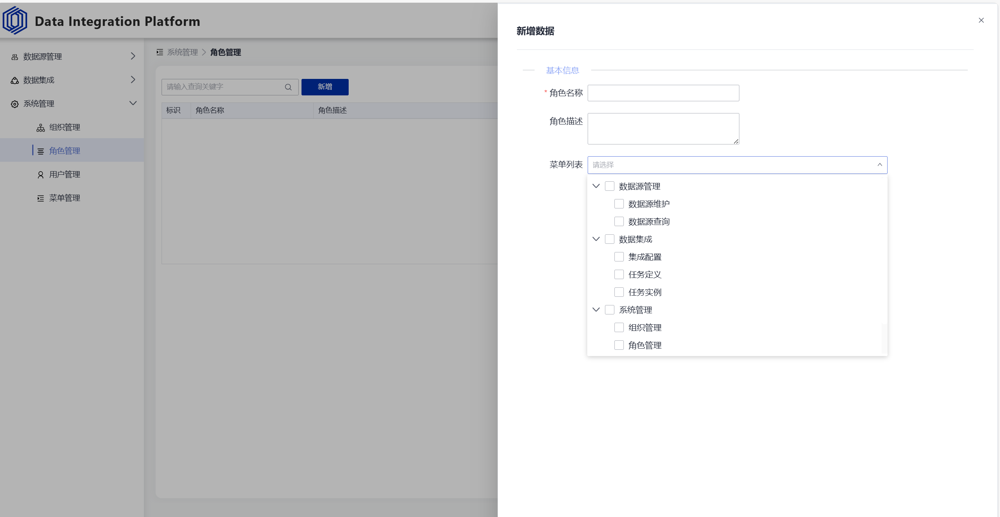

## Data Integration Platform 介绍
Data Integration Platform 是 Bigprime DGP 大数据治理平台中的一个核心子平台，专注于数据源管理和数据集成。该平台致力于通过高效的数据整合与管理，帮助企业实现数据驱动的价值创造。借助先进的插件化架构和灵活的自定义配置，Data Integration Platform 能够快速响应各种复杂的数据集成需求，为企业的数据治理之路提供坚实的技术支撑。

## 目标及特点
- **多源支持：** 支持对接多种数据库，包括但不限于MySQL、PostgreSQL、Oracle、MongoDB等，通过统一的管理界面进行连接和配置。
- **即席查询：** 提供即席查询功能，用户无需预先定义查询，即可实时对数据进行探索和分析。
- **SPI插件思想：** 采用SPI（Service Provider Interface）插件思想，允许用户快速扩展新的数据源类型，无需修改核心代码，极大提升了系统的可扩展性。
- **Addax与Seatunnel集成：** 内置对Addax和Seatunnel的支持，用户可以通过自定义配置，实现不同数据源之间的数据集成任务。
- **自定义配置：** 支持高度自定义的数据集成配置，用户可以根据具体需求，灵活调整数据同步的策略、速率和方式。
- **灵活扩展：** 基于插件化架构，用户可以根据需要扩展新的数据集成工具或方法，满足不断变化的数据集成需求。

## 设计理念
**插件式开发**
- Data Integration Platform 采用了插件式开发的设计理念，将数据源管理和数据集成功能模块化，每个模块都可以作为独立的插件进行开发和扩展。这种设计方式不仅提高了系统的可维护性，还使得用户可以轻松定制和扩展系统功能，满足特定的业务需求。

**数据集成灵活性**
- 在数据集成方面，平台支持对Addax和Seatunnel的自定义配置，用户可以通过简单的配置调整，实现复杂的数据同步任务。

**扩展性强**
- 通过SPI插件思想，平台能够轻松扩展新的数据源和数据集成工具，无需修改核心代码，即可实现功能的扩展和升级。这种设计方式使得平台能够持续适应不断变化的数据环境和技术趋势。

## 架构设计


## 技术选型

**后端技术**
- **Spring Boot：** 用于快速构建独立的、生产级别的Spring应用程序，提供了丰富的内置功能，简化了配置和开发过程。
- **Spring Cloud：** 提供了微服务架构的完整解决方案，包括服务发现、配置管理、负载均衡等，提高了系统的可靠性和可扩展性。
- **Nacos：** 作为服务发现和配置中心，为微服务架构提供了动态的服务管理和配置更新能力。
- **easy-query：** 简化了数据库查询操作，提供了便捷的查询构建和执行功能，支持强类型对象关系查询和强类型SQL语法查询的ORM,拥有对象模型筛选、隐式子查询、隐式join、显式子查询、显式join。
- **Hutool：** 一个Java工具类库，提供了丰富的常用工具类，简化了开发过程中的重复代码。
- **Maven：** 作为项目构建工具，提供了依赖管理和构建自动化的功能，提高了开发效率。

**前端技术**
- **Vue3：** 作为前端框架，提供了更高效的响应式机制和更好的性能表现，支持组件化开发，提高了代码的可复用性和可维护性。
- **Opentiny：** 一个轻量级的前端UI框架，提供了丰富的组件和样式，简化了UI开发过程。
- **Pinia：** 作为Vue的状态管理库，提供了简洁易用的API，提高了状态管理的效率和可维护性。
- **vue-router：** 用于前端路由管理，支持页面跳转和组件懒加载，提高了用户体验。
- **TypeScript：** 作为JavaScript的超集，提供了静态类型检查和强大的类型系统，提高了代码的可读性和健壮性。
- **Vite：** 作为前端构建工具，提供了极快的构建速度和友好的开发体验，支持热模块替换和按需加载。

## 产品效果图





## 支持的数据库列表

<div>


</div>

## 快速开始
### 启动项目
**启动后端**
- **初始化数据库**
  - 创建数据库
    - 创建 `bigprime` 数据库(可自定义名称)，数据库编码为`utf8mb4`
    - 执行 `/resources/sql/bigprime.sql` 初始化数据库
- **启动Nacos服务并导入Nacos配置，Nacos配置信息在`/resources/nacos_config.zip`**
- **启动网关服务：** 运行 `GatewayApplication.java`
- **启动Web服务：** 运行 `BigPrimeWebApplication.java`

**启动前端**
- **bigprime-ui项目默认会初始化执行环境**
  
  - 默认安装版本**node版本v21.6.2**，**npm版本10.5.0**，在bigprime-ui项目pom.xml中可进行修改
- **启动前端服务：**
  ```shell
  npm run dev
  ```

### 数据源管理
#### 数据源维护
- **新增数据源**
支持MySQL、PostgreSQL、ClickHouse、Doris、Dameng、Hive、MongoDB、Oracle、Redis、SqlServer、Kafka、Zookeeper等数据库，保存会检测连接是否正常，也可点击测试连接按钮自行检测。
  

- **编辑数据源**
编辑数据源支持修改数据库连接信息、数据源描述等。


- **删除数据源**
删除数据源，默认逻辑删除。


- **心跳检测**
系统默认30分钟定时检测数据库连接是否正常，如果异常，则自动断开连接，修改状态为失败，用户也可点击以下按钮进行手动检测。


#### 数据源查询
- **SQL查询**
SQL语句即席查询，点击选中数据库名，即可进入SQL查询页面，支持SQL语法查询。

- **可视化查询**
可视化即席查询，点击选中表名，即可进入可视化查询页面，可根据字段条件进行查询。

### 数据集成
#### 集成配置
- **seatunnel 配置**
  - **env 配置支持配置全局参数，如：rest_api、job.name、event_url、job.mode、parallelism等。**
  		
  
  - **source 配置支持自定义，如Jdbc、FakeSource等，对应的自定义配置项支持动态参数，如：url、username、password、table_path、query等。**
  
  
  - **transform 配置支持自定义，如Filter、Replace等，对应的自定义配置项支持动态参数，如：replace_field、replacement。**
  
  
  - **sink 配置支持自定义，如Jdbc、Console等，对应的自定义配置项支持动态参数，如：url、username、password、table、result_table_name等。**
  
  
- **addax 配置**
  - **setting 配置，支持配置全局参数，如：job.name、byte、record、addax_home、event_url等。**
  
  - **reader 配置，支持自定义插件，如rdbmsreader、streamreader、excelreader等，对应的自定义配置项支持动态参数，如：jdbcUrl、username、password、column、fetchSize等。**
  
  - **writer 配置，支持自定义插件，如rdbmswriter、txtfilewriter，对应的自定义配置项支持动态参数，如：jdbcUrl、column、preSql、postSql等。**
  
#### 任务定义
- **创建任务**，如：seatunnel、addax。

- **任务配置**
  - **seatunnel 任务配置**
  
  - **addax 任务配置**
  
- **任务相关操作**

#### 任务实例
- **任务实例列表**

- **任务实例配置详情**

- **任务实例日志详情**


### 系统管理
#### 组织管理
- **支持创建、编辑、删除组织，支持配置组织角色。**

#### 角色管理
- **支持创建、编辑、删除角色，支持配置角色菜单权限。**

#### 用户管理
- **支持创建、编辑、删除用户，支持配置用户角色。**

#### 菜单管理
- **支持创建、编辑、删除菜单，支持配置菜单权限。**


## 联系我们
- **欢迎您加入社区交流分享**
  - **微信交流群**
  

  - **QQ交流群：**
  
